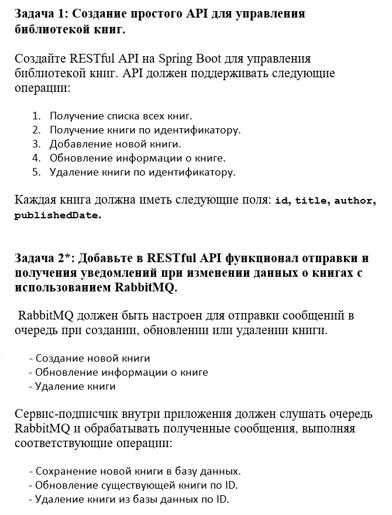

# Задание

# Применяемые технологии
1. Java 17
2. Spring (JPA, Boot)
3. RabbitMQ
4. Swagger
5. Lombok

# Инструкция к запуску

1. Склонировать репозиторий на локальное устройство.
2. Настроить подключение к БД. По умолчанию название БД smsfinance. Настройки находятся в src/main/resources/application.properties. В той же папке data.sql и schema.sql для генерации БД.
3. Запустить RabbitMQ сервер. Настройки находятся в src/main/resources/application.properties
4. Запустить приложение через среду разработки или через консоль командой mvn spring-boot:run в корне проекта.
5. Перейти по адресу http://localhost:8080/swagger-ui/index.html# для тестирования API.